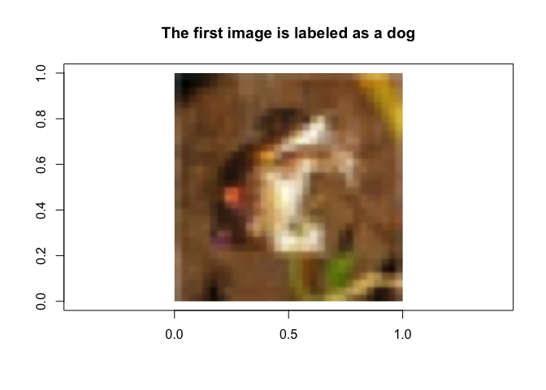
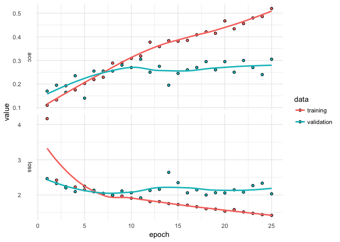

kerasformula for Image Classification: cifar10
================
Pete Mohanty

This document shows how to classify images using the [cifar10](https://www.cs.toronto.edu/~kriz/cifar.html) using `kms` from `library(kerasformula)`. Newly on `CRAN`, `kerasformula` offers a high-level interface for `library(keras)`.

`kms` builds dense neural nets and, after fitting them, returns a single object with predictions, measures of fit, and details about the function call. `kms` accepts a number of parameters including the loss and activation functions found in `keras`. `kms` also accepts compiled `keras_model_sequential` objects allowing for even further customization. This little demo shows how `kms` can aid is model building and hyperparameter selection (e.g., batch size) starting with raw data gathered using `library(rtweet)`.

To get going, make sure that `keras` is configured.

``` r
install.packages("kerasformula", "rtweet")
library(kerasformula)
install_keras()                        # first time only. see ?install_keras() for install options
                                       # like install_keras(tensorflow = "gpu")
```

Assuming you've [downloaded](https://www.cs.toronto.edu/~kriz/cifar.html) and decompressed the binary data, you should have a file structure like this. (Each `.bin` file contains 10,000 images.)

``` r
dir("cifar-10-batches-bin/")
```

    [1] "batches.meta.txt" "data_batch_1.bin" "data_batch_2.bin"
    [4] "data_batch_3.bin" "data_batch_4.bin" "data_batch_5.bin"
    [7] "readme.html"      "test_batch.bin"  

What are the labels?

``` r
labs <- readLines("cifar-10-batches-bin/batches.meta.txt")[1:10]
labs 
```

     [1] "airplane"   "automobile" "bird"       "cat"        "deer"      
     [6] "dog"        "frog"       "horse"      "ship"       "truck"     

This tutorial shows how to work with the images stored as binary archives; for details on working with this type of data, see [here](https://stats.idre.ucla.edu/r/faq/how-can-i-read-binary-data-into-r/). In this case, colors are represented by integers between 0 and 255 and so are only one byte each.

``` r
to_read <- file("cifar-10-batches-bin/data_batch_1.bin", "rb")
first_image <- readBin(to_read, integer(),
                       n = 3073,          # size of a single image, including label
                       size = 1,          # read in byte-by-byte
                       signed = FALSE     # ensure colors on [0, 255]
                       )
close(to_read)                            # close file connection
```

All images are 32 \* 32 and each of those 1,024 pixels can be represented in terms of red, green, and blue. Since the first element is the label, each image is represented by a length 3,073 vector.

``` r
length(first_image) == 1 + (3 * 32^2) 
```

    [1] TRUE

``` r
rimg <- as.raster(array(first_image[-1], dim=c(32, 32, 3))/255)
# raster multilayer object on [0, 1]
r <- nrow(rimg) / ncol(rimg) # image ratio
# set up blank plot and then add image with rasterImage()
plot(c(0,1), c(0,r), type = "n", xlab = "", ylab = "", asp=1,
     main = paste("The first image is labeled as a", labs[first_image[1]]))
rasterImage(rimg, 0, 0, 1, r) 
```



The key to a good machine learning algorithm apparently lies in teaching the computer to squint.

Let's start by reading in all of the data.

``` r
Nperfile <- 200 # 10,000 for full sample. otherwise N from each file.

test_file <- file("cifar-10-batches-bin/test_batch.bin", "rb")
raw_data <- readBin(test_file, integer(), n = 3073*Nperfile, size = 1, signed = FALSE)
close(test_file)
y_test <- raw_data[seq(1, length(raw_data), 3073)]
X_test <- matrix(raw_data[-seq(1, length(raw_data), 3073)], nrow = Nperfile, byrow=TRUE)

y_train <- matrix(nrow = 5*Nperfile, ncol = 1)
X_train <- matrix(nrow = 5*Nperfile, ncol = 3*1024)

for(i in 1:5){
  train_file <- file(dir("cifar-10-batches-bin/", pattern = "data_", full.names = TRUE)[i], "rb")
  raw_data <- readBin(train_file, integer(), n = 3073*Nperfile, size = 1, signed = FALSE)
  close(train_file)
  y_train[1:Nperfile + (i - 1)*Nperfile] <- raw_data[seq(1, length(raw_data), 3073)]
  X_train[1:Nperfile + (i - 1)*Nperfile, ] <- matrix(raw_data[-seq(1, length(raw_data), 3073)], 
                                       nrow = Nperfile, byrow=TRUE)
}
remove(raw_data)
```

A few spot checks...

``` r
table(y_test)       # if Nperfile = 10000, then should be 1,000 of each label
```

    y_test
     0  1  2  3  4  5  6  7  8  9 
    20 14 21 19 15 18 26 18 28 21 

``` r
table(y_train)      # if Nperfile = 10000, then should be 5,000 of each label
```

    y_train
      0   1   2   3   4   5   6   7   8   9 
     83 114  94  99 109  98 101 104  94 104 

``` r
range(X_train)       
```

    [1]   0 255

``` r
range(X_test)       # range should be 0 to 255
```

    [1]   0 255

In the full dataset, there are 5,000 of each type of image in the training data and 1,000 of each in the testing data.

`kms()` expects a `data.frame.`

``` r
training <- data.frame(lab = y_train, X = X_train) # rescale X to [0, 1]
testing <- data.frame(lab = y_test, X = X_test)
rm(X_train, X_test)
```

`kms()` automatically splits the data into testing and training, however in this case the data are already split that way. Setting `kms(..., pTraining = 1)` and then calling `predict` on the outputted object along with the test data. `kms()` automatically puts data on a \[0, 1\] scale (but that can be altered, for example `kms(..., x_scale = scale)` standardizes). By default, `kms()` builds a dense model, meaning the simplest thing we can do is ...

``` r
fit <- kms(lab ~ ., training, pTraining = 1)
plot(fit$history) + theme_minimal()
```



``` r
forecast <- predict(fit, testing)
forecast$accuracy
```

    [1] 0.345

That's pretty bad. The widening gap between the training and validation suggests overfitting is setting in and that fewer epochs would have done just as well. That can be done by setting `kms(lab ~ ., training, pTraining = 1, Nepochs = 10)`. For a worked example showing options along these lines like loss and activation function and how to customize dense neural nets, see [here](https://tensorflow.rstudio.com/blog/analyzing-rtweet-data-with-kerasformula.html).
