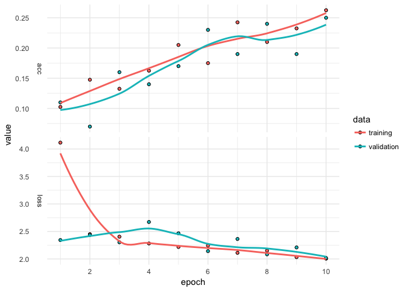

lstm for Image Classification with kerasformula cifar10
================
Pete Mohanty

This document shows how to classify images using the [cifar10](https://www.cs.toronto.edu/~kriz/cifar.html) using `kms` from `library(kerasformula)` and the [data preparation found here](https://github.com/rdrr1990/kerasformula/blob/master/examples/cifar10/kerasformula_cifar10.md). The example below uses N = 500 for training (of which 20% is used for validation) and 100 for testing. 

``` r
k <- keras_model_sequential()
k %>%
  layer_embedding(input_dim = 3072, output_dim = 1024) %>% 
  layer_lstm(units = 512, dropout = 0.5, recurrent_dropout = 0.25) %>% 
  layer_dense(units = 128, activation = "relu") %>%
  layer_dropout(0.3) %>%
  layer_dense(units = 10, # number of levels observed on y or just 1 if binary  
              activation = "sigmoid")

k %>% compile(
  loss = 'categorical_crossentropy',
  optimizer = 'adam',     # ?optimizer_adam
  metrics = c('accuracy')
)

fit <- kms(as.factor(lab) ~ ., training, k, pTraining = 1, Nepochs = 10)
plot(fit$history) + theme_minimal()
```



``` r
forecast <- predict(fit, testing)
forecast$accuracy
```

    [1] 0.23
